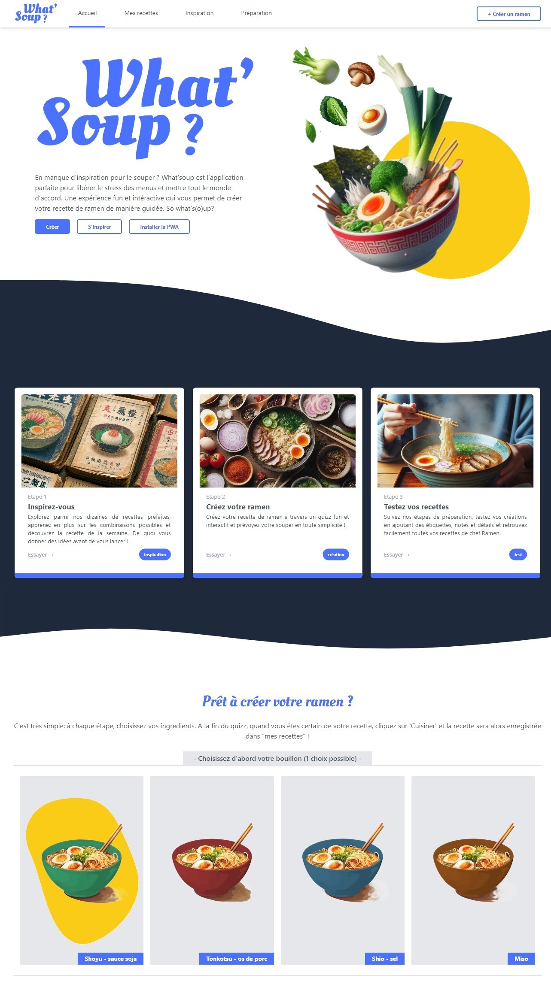
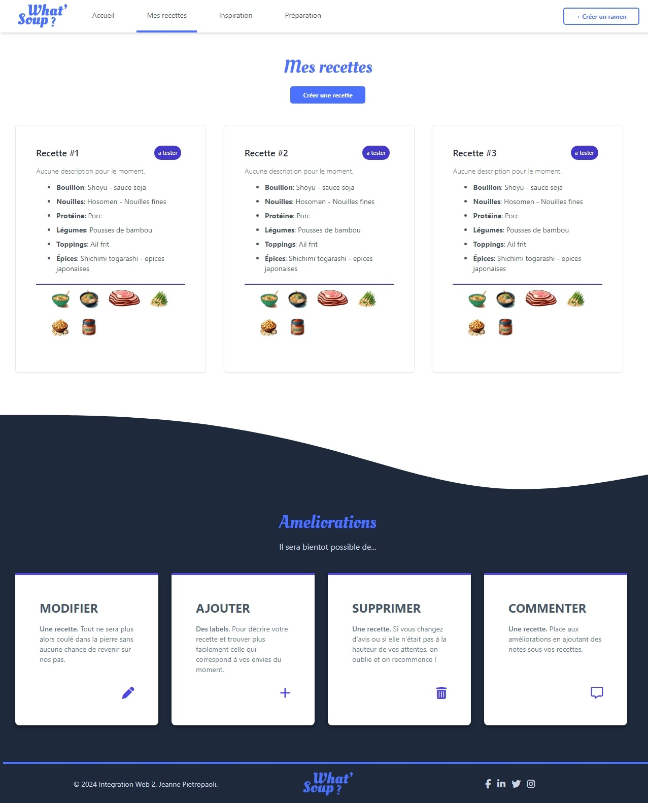
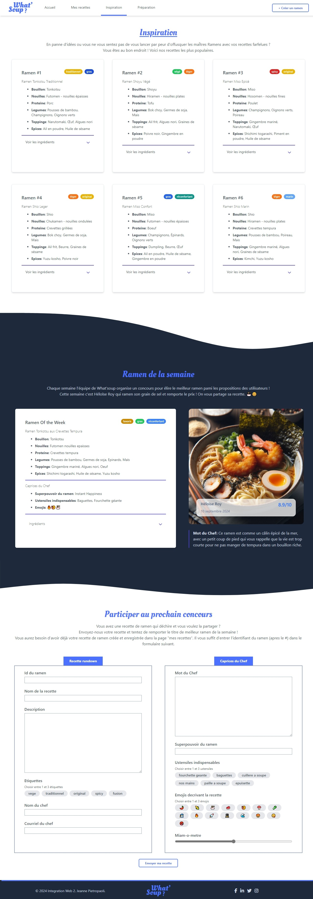
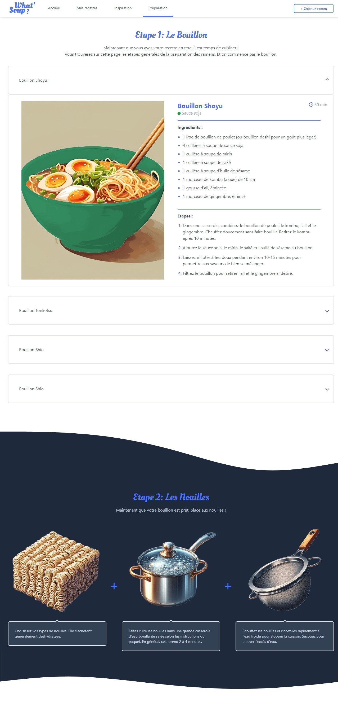
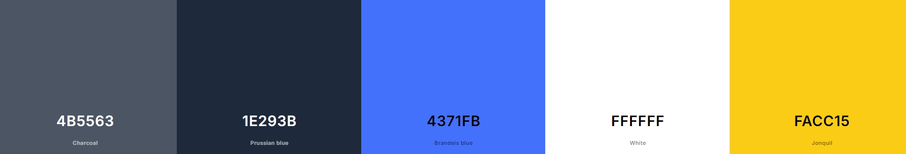

# TP3 PWA - Intégration Web 2

Elève: Jeanne Pietropaoli

## Lien

Repo : https://github.com/jeannepietropaoli/Integration_web_PWA_Jeanne_Pietropaoli
Live: https://jeannepietropaoli.github.io/Integration_web_PWA_Jeanne_Pietropaoli/index.html

## Description

Le but est de créer une PWA (Progressive Web App) sur le sujet de notre choix. Le design est lui aussi libre.

J'ai choisi de monter un site de création de ramens en ligne: "What'soup?". De l'inspiration à la création en passant par les étapes de préparation, What'soup est une application fun et interactive sur un sujet qui plait au plus grand nombre pour conconcter vos meilleures (ou vos pires) recettes ! 

## Aperçu   

## Objectifs

*  Elaborer un **design** intéressant
*  Ecrire du **code HTML propre** et **accessible**
*  Se perfectionner dans l'utilisation des classes **Talwind CSS**
*  Utiliser des composants **Talwind CSS** et les adapter selon nos besoins
*  Utiliser les outils **git et Github** pour le versionning de notre code
*  Pratiquer la méthodologie **BEM**
*  Pratiquer le **SASS**
*  Fournir un **full responsive** notamment grâce aux **grilles Tailwind**
*  Obtenir une **Progressive Web App** grâce à un **manifest** et un **service-worker** complets et fonctionnels
*  Pratiquer la **validation des formulaires** avec JS

## Design

* ### Fonts :

  * Font Tailwind par défaut
  * Oleo Script (titres) [->](https://fonts.google.com/specimen/Oleo+Script)

* ### Palette de couleurs :

Palette colorée / fun à l'image du projet:

## Technologies utilisées

* HTML
* SASS
* JavaScript
* Tailwind CSS

## Composants Tailwind utilisées

* Composant **accordéon** : https://www.material-tailwind.com/docs/html/accordion
   -> Utilisé dans les cartes de recettes de ramen pour faire apparaître la liste des ingrédients sous forme d'images (page inspiration.html) et dans les cartes de recettes de bouillon (page preparation.html)

* Composant **Navbar responsive** : 'Simple dark with menu button on left' https://tailwindui.com/components/application-ui/navigation/navbars-->

* Composant **tooltip** : https://codepen.io/robstinson/pen/oNxPbRL
   -> Utilisé sur les mini images dans les cartes de recettes de ramen (page inspiration.html) pour décrire l'ingrédient au survol

* Composant **image avec légende effet flou** : https://www.material-tailwind.com/docs/html/image (Image with Blurred Caption)
   -> Utilisé pour l'image de la recette de la semaine (page inspiration.html)

* Composant **accordéon d'images** : https://codepen.io/cruip/pen/LYobVRg
   -> Utilisé pour l'accordéon d'images dans la section 'Assemblage' de la page preparation.html

* Composant **étapes** : https://mambaui.com/components/steps
   -> Utilisé pour les étapes de l'assemblage du ramen de la page preparation.html

## Notes

Le formulaire à évaluer est celui au bas de la page inspiration.html.

Les images ont été générées grâce à l'outil Bing Image Creator (IA).

## Améliorations

Je voulais rendre le projet plus interactif que les précédents, mais j'étais assez limitée du fait des langages utilisés, plutôt orientés pour des sites plus statiques. Le JS pour la création des ramens n'est pas le plus optimisé et je prévois reconstruire le projet avec React de manière beaucoup plus simple et efficace ! 